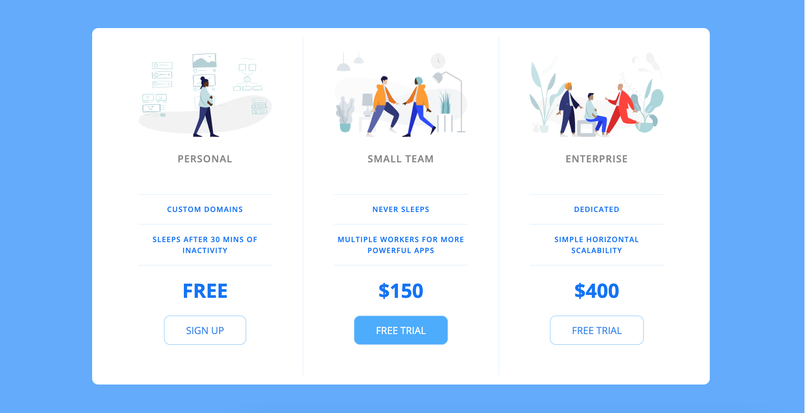
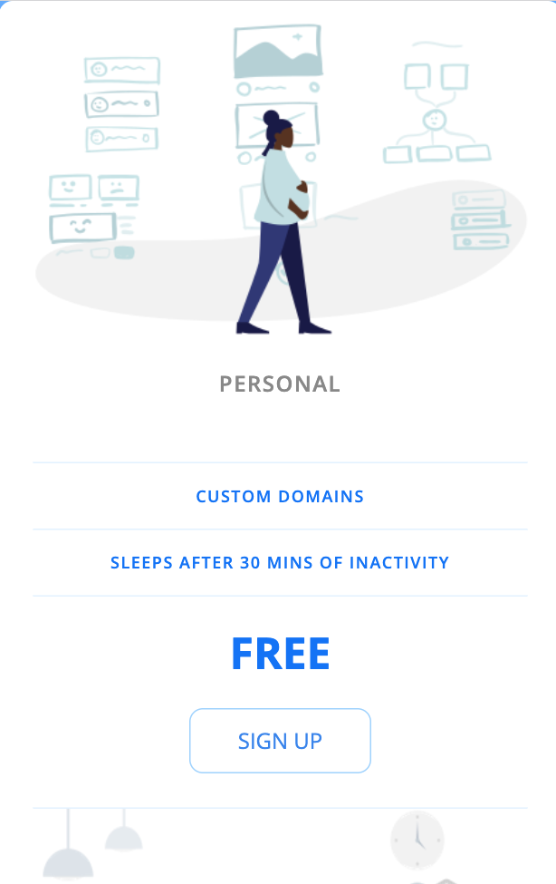

# Pricing_Panel Project

Pricing_Panel is a simple page that demonstrates some styling with CSS

## Final Product

Desktop View of Pricing Panel Page:

Mobile View of Pricing Panel Page:

## Getting Started

1. Install dependencies using the `npm install` command.
2. Start the web server using the `npm start` command. The app will be served at <http://localhost:8080/>.
3. Go to <http://localhost:8080/> in your browser.

## Dependencies

- Express
- Node.js